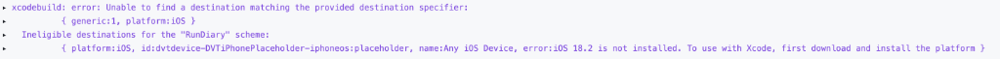
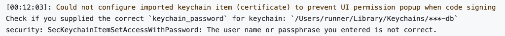

### 0️⃣ 이렇게 세팅했어요

- Fastlane 연동
- Github Actions workflow 추가 (`release/**` 브랜치 푸시 시 Testflight 배포)
- Fastlane match로 인증서 관리 (Git 저장소 기반)

### 1️⃣ Xcode 버전 불일치 문제 (feat. iOS 18 SDK)

로컬에서는 빌드가 잘 되는데, GitHub Actions CI에서만 빌드가 실패하는 현상이 발생했습니다.  
  

  
#### 원인

GitHub Actions Runner(`macos-latest`)가 제공하는 Xcode 버전에 iOS 18.2 SDK가 포함되어 있지 않아서 빌드 destination을 찾지 못하는 문제였습니다.  
  
#### 해결

`maxim-lobanov/setup-xcode` 액션을 사용하여 워크플로에서 사용할 Xcode 버전을 명시적으로 지정해 주었습니다.

```yaml
# testflight.yml
- name: 2️⃣ Setting Xcode Version
  uses: maxim-lobanov/setup-xcode@v1
  with:
    xcode-version: latest-stable
```

### 2️⃣ Keychain 비밀번호 불일치 문제

"There are no local code signing identities found" 로그가 계속 발생해서 처음엔 이게 문제인 줄 알았는데, 알고 보니 이 로그는 **CI 환경에서 새로운 가상환경이 생성되기 때문에 발생하는 당연한 로그**였습니다.  

진짜 문제는 따로 있었습니다:  
  


#### 원인

이전 워크플로 실행에서 같은 이름으로 키체인을 생성한 적이 있었는데, 이후에 비밀번호나 키체인 이름을 변경하면서 **기존 키체인과 새 비밀번호가 일치하지 않는 문제**가 발생한 것이었습니다.  
  
#### 해결

`Fastfile`에서 키체인 생성 전에 **기존 키체인을 삭제**하고 새로 생성하도록 수정했습니다.

```ruby
# Fastfile
lane :beta do
  # ⚠️ 기존 키체인 삭제 (비밀번호 불일치 방지)
  sh("security delete-keychain #{ENV['KEYCHAIN_NAME']} || true")

  # 1️⃣ Keychain 생성
  create_keychain(
    name: ENV["KEYCHAIN_NAME"],
    password: ENV["KEYCHAIN_PASSWORD"],
    timeout: 3600,
    default_keychain: true,
    unlock: true,
    lock_when_sleeps: false,
    add_to_search_list: true
  )

  # 2️⃣ Match 인증서/프로비저닝 설정
  match(
    git_url: ENV["MATCH_GIT_URL"],
    storage_mode: "git",
    type: "appstore",
    readonly: true,
    keychain_name: ENV["KEYCHAIN_NAME"],
    keychain_password: ENV["KEYCHAIN_PASSWORD"]
  )

  # ... 이하 생략 ...
end
```
  
> "There are no local code signing identities found" 로그는 키체인 삭제 후에도 여전히 찍히지만, 이는 시스템 기본 키체인을 조회하는 과정에서 나오는 것이라 무시해도 됩니다.  
> 실제 빌드는 새로 생성한 키체인을 사용하므로 워크플로는 정상적으로 성공합니다 😅