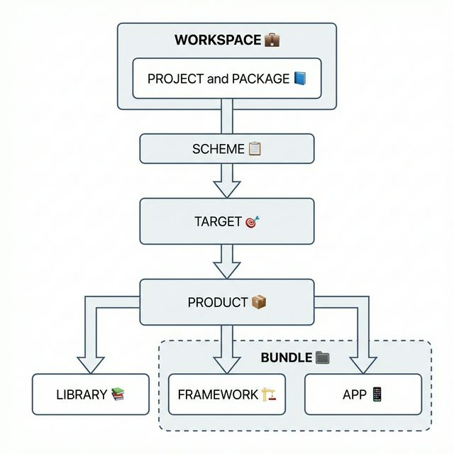

혹시 Xcode에서 스킴(Scheme) 리스트를 보다가, 거의 동일하게 구성한 패키지인데도 아이콘이 다르게 나오는 걸 보신 적 있으신가요? 🤔  
  
저도 최근 개인 프로젝트를 진행하다가 이 차이를 우연히 발견하고, 어떤 의미가 숨어있는지 궁금해져서 한 번 알아보게 되었습니다.  
  
제가 의문을 가졌던 심볼은 `❖`와 `🏛️`였는데요, 아래 스크린샷처럼 동일한 성격의 패키지임에도 아이콘 모양이 다르게 나타나고 있었습니다.
  

  
가볍게 확인해 본 결과, 두 심볼의 차이는 다음과 같았습니다.  
- ❖ : 한 번도 빌드나 테스트를 실행하지 않아서 **암시적으로 생성된 스킴**
- 🏛️ : 한 번이라도 빌드나 테스트를 시행하여 `.xcscheme` 파일이 생겨 **명시적으로 생성된 스킴**
  
단순히 이 이유만 알고 넘어가도 좋겠지만, 이참에 스킴과 타겟 등 헷갈리기 쉬운 Xcode의 기본 개념들을 다시 한번 짚고 넘어가면 좋겠다는 생각이 들었습니다. 💡  
  
그래서 이번 포스팅에서는 Xcode를 이루는 주요 키워드들의 정의와 각 키워드 간의 관계를 통해 전체적인 동작 흐름을 정리해 보려고 합니다. 저처럼 개념들을 좀 더 명확하게 다져보고 싶으신 분들께 도움이 되었으면 좋겠습니다! 🙌  
  

### 📌 한눈에 보는 키워드 정의
  
먼저 Xcode 프로젝트를 구성하는 대표적인 키워드들을 알기 쉽게 정리해 보겠습니다.

#### 🗂️ Workspace (워크스페이스)
여러 개의 Project와 Package를 그룹화하여 관리하는 가장 큰 **최상위 컨테이너**입니다. 프로젝트 간의 암시적 의존성(Implicit Dependency)을 하나로 묶어 부드럽게 해결해 주는 역할을 해요.

#### 📘 Project (프로젝트)
소스 코드, 사용할 리소스, 빌드 설정, 그리고 다음에 설명할 'Target'들을 오롯이 담고 있는 **저장소**입니다.

#### 📦 Product (프로덕트)
말 그대로 결과물입니다! Target을 성공적으로 컴파일하고 빌드해서 만들어낸 **최종 결과물**(앱, 프레임워크, 라이브러리 등)을 의미합니다.

#### 🗃️ Bundle (번들)
내부적으로 실행 가능한 코드와 해당 코드가 살펴보는 리소스(이미지, xib, 다국어 파일 등)를 표준화된 계층 구조로 묶어놓은 **하나의 디렉토리**입니다. 우리가 흔히 아는 `.app`이나 `.framework`가 대표적인 번들 형태랍니다.

#### 📚 Library (라이브러리)
컴파일된 소스 코드들을 단순히 모아둔 덩어리입니다. 자체적인 리소스를 품을 수는 없으며, 연결 방식에 따라 정적(Static)과 동적(Dynamic) 라이브러리로 나뉩니다.

#### 🏗️ Framework (프레임워크)
라이브러리(코드)와 리소스, 헤더 파일 등을 하나의 독립된 패키지처럼 캡슐화한 **Bundle의 일종**입니다! 라이브러리보다 조금 더 크고 리소스까지 포함된 개념으로 이해하시면 좋습니다.

> **💡 핵심 요약 노트:**  
> `Target`은 프로젝트 내에서 앞으로 빌드할 결과물의 **설계도(명세서)**라면, 이번에 의문을 가졌던 대상인 `Scheme`은 특정 Target을 어떻게 빌드하고 테스트할지 정의해 주는 **작업 지시서**라고 이해할 수 있습니다.

### 🔗 전체 키워드의 상관관계 (계층 및 실행 흐름)

그렇다면 이 키워드들은 서로 어떻게 연결되어 동작할까요? 전체적인 계층과 실행 흐름에 따라 단계별로 따라가 보겠습니다. 🚶‍♂️🚶‍♀️  
  

  
1. 가정 먼저, **Workspace**라는 큰 틀이 여러 **Project**와 **Package**를 품고 있습니다.
2. 각각의 **Project**와 **Package**는 무엇을 만들지에 대한 빌드 설계도인 **Target**을 하나 이상 가지고 있어요.
3. 이때 작업 지시서인 **Scheme**이 나서서 특정 **Target**을 빌드하거나 테스트하도록 제어해 줍니다.
4. **Target**이 성공적으로 빌드 과정을 마치면, 짜잔! 드디어 결과물인 **Product**가 탄생합니다.
5. 이 **Product**의 구체적인 형태가 바로 우리가 만드는 **Library**, **Framework**, 혹은 앱(App) 등이 되는 것이죠.
6. 마지막으로 결과물 중 **Framework**나 앱은 내부에 이미지 같은 별도의 리소스를 가질 수 있도록 **Bundle** 구조를 취하게 됩니다.
  
이러한 관계와 흐름을 직접 따라가 보니, Xcode가 우리의 프로젝트를 어떻게 관리하고 조립해 나가는지 큰 그림이 그려지지 않으시나요? ✨   
  
처음 스킴 심볼을 보고 가졌던 작은 호기심 덕분에, `Scheme`과 `Target`, 그리고 그 너머의 개념들까지 더 깊이 이해해 보는 뜻깊은 시간이었습니다. 여러분의 프로젝트 작업에도 작은 힌트가 되었기를 바랍니다! 😊