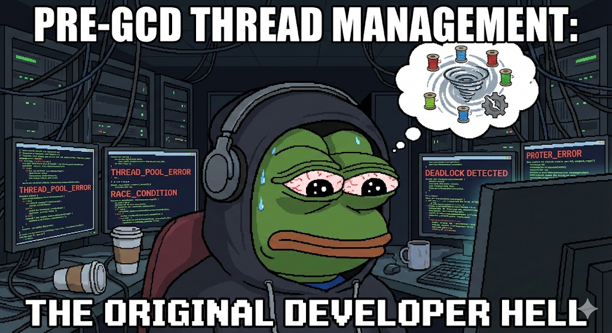

## 1️⃣ 동시성(Concurrency)

**논리적으로 여러 작업이 동시에 실행되는 것처럼** 보이도록 하는 처리 방식입니다.  
  
물리적으로 동시에 여러 작업이 수행되는 **병렬성**(Parallelism)과 달리, CPU가 **시분할** 기법을 통해 빠르게 **문맥 교환**을 반복함으로써 여러 작업이 동시에 실행되는 것처럼 느낄 수 있습니다.   

- **시분할(Time Slicing)** : 시간을 쪼개 여러 스레드를 오가는 기법
- **문맥 교환(Context Switching)** : CPU가 현재 실행중인 작업의 상태를 저장하고, 다음 실행할 작업의 상태를 읽어와 교체하는 과정
  - 멀티태스킹의 핵심 메커니즘

### 동시성의 대표적인 문제

1. **Race Condition (경쟁 상태)**

    **두 개 이상의 스레드**가 **공유 자원에 동시에 접근**하여, **실행 순서에 따라 결과가 달라지는 문제**입니다.

2. **Data Race (데이터 경쟁)**

    Race Condition 문제에서, 두 개 이상의 스레드 중 **최소 하나가 쓰기(Write) 작업일 때** 발생하는 문제입니다.

3. **Deadlock (교착 상태)**

    두 개 이상의 스레드가 **서로가 가진 자원의 Lock이 해제되기만을 무한히 기다리며**, 결과적으로 아무것도 진행하지 못하는 상태입니다.  
    *이때 앱은 freeze 됩니다.*

4. **Starvation (기아 상태)**

    작업이 계속해서 **우선 순위에 밀려** 실행되지 못하는 상태입니다.  
    주로 우선순위 스케줄링에서 발생합니다.

5. **Priority Inversion (우선순위 역전)**

    우선순위가 높은 작업이 우선순위가 낮은 작업 때문에 실행이 지연되는 현상입니다.

## 2️⃣ GCD 이전, iOS에서는 어떻게 동시성을 관리했을까?

GCD 이전(iOS 4가 등장하기 전)까지는 **Thread 기반 모델**을 지원했기 때문에, **개발자가 직접 스레드를 생성하고 관리**해야 했습니다.  
**POSIX Threads(pthreads), NSTread**를 통해 명시적으로 생성하고 제거합니다.   
직접 제어하는만큼 **생명주기 관리, 동기화 책임, 부하 관리** 책임이 따르고, 직접 제어하는 데에 발생하는 문제들이 있었습니다.
  

### 대표적인 문제

1. **스레드 폭발 (Thread Explosion)**

    스레드가 무한정 늘어나면 **메모리 사용량이 급증**하고, **Context Switching 비용도 급증**합니다.
      
    > 📚 **스레드의 메모리 사용량**  
    > 스레드는 생성될 때마다 **스택(Stack) 메모리**를 할당받습니다.  
    > 스레도 폭발로 인해 **앱 크래시**가 발생하는 것은 스택 할당으로 인한 메모리 사용량 때문입니다.
      
    > 💸 **Context Switching 비용**  
    > 스레드가 많아지면 OS는 더 자주 Context Switching을 시도하면서 **캐시 오염**과 같은 비용이 발생합니다.  
    CPU는 속도를 위해 데이터를 미리 캐시 메모리에 저장해놓는데, 스레드가 전환되면서 **기존 캐시 데이터가 무효화되거나 새로운 데이터로 덮어쓰여지는 현상**을 캐시 오염이라고 합니다.  
    > 이때 **새로운 데이터를 가져오기 위해 램에 접근하는 비용**이 발생하게 됩니다.

2. **성능 예측 불가**

    동시성으로 인한 **Race Condition 문제를 방지하기 위해** 공유 자원에 접근시 **Lock**을 걸어서 다른 스레드에서 동시에 접근할 수 없도록 막습니다.  
    이때 공유 자원에 접근하기 위해 스레드를 재웠다가 깨우는 비용과 작업 순서를 보장할 수 없는 현상이 발생합니다.  

    > 💸 스레드를 재우고 깨우는 Sleep/Wake 작업은 **OS 제어 영역**이기 때문에 **무거운 작업**입니다.  
      
    이러한 **불확실한 작업 순서**와 **무거운 비용 발생**으로 인해 프로그램의 성능 예측이 불가해집니다.  

3. **복잡한 Main Thread 전환**

    비동기 작업 후 **메인 스레드로 전환하는 코드를 누락**하기 쉽기 때문에, 실수를 유발하기 쉬운 **Human Error** 환경입니다.

4. **개발자 생산성 저하**
    
    복잡한 스레드 생명주기 관리를 개발자가 직접 해야 하기 때문에, **코드 작성과 작업 관리** 측면에서 개발 생산성이 저하될 수 있습니다.

## 3️⃣ 스레드는 비싸다, 왜 비쌀까?
  
### 스레드(Thread)
스레드는 **프로세스 내에서 실행되는 흐름의 최소 단위이자, CPU 스케줄링의 기본 단위**입니다.  

#### 핵심 특징

1. **프로세스보다 생성 및 종료 비용이 적어 가볍다.**  
2. **같은 프로세스 내 스레드들은 Code, Data, Heap 메모리를 공유한다.**  
3. **각 스레드는 독립적인 Stack, Register, PC 영역을 갖는다.**  
   
> 🧠 **PC(Program Counter)**  
> 다음에 실행할 명령어의 주소를 가리키며, 스레드 별로 독립적이기 때문에 스레드 간 Context Switching이 가능합니다.  
  
> 📦 **레지스터(Register)**  
> 변수값이나 연산 결과를 임시로 저장할 수 있는 공간이기 때문에, Context Switching을 할 때 이전 작업 상태를 복구할 수 있습니다.  
  
> 💾 **스택(Stack)**  
> 함수 호출 순서와 함수 내 지역 변수를 저장하기 때문에 스레드 별로 독립적인 작업을 처리할 수 있습니다.

### 스레드가 비싼 이유

1. **커널이 직접 관리하는 커널 리소스다.**  
2. **독립된 Stack 메모리를 갖는다.**
3. **Context Switching은 비싸다.**
4. **스케줄링 경쟁과 동기화 비용을 유발한다.**
  
> 👷‍♂️ **커널 (Kernel)**  
> **하드웨어에 직접 접근할 수 있는 유일한 영역**으로, 운영체제의 핵심 영역입니다.  
> 스레드 생성시 스레드 관리를 위해 관련 데이터를 저장하는 **커널 객체**도 함께 생성됩니다.
  
> 👮‍♂️ **스레드 동기화**  
> 멀티스레드 환경에서 발생할 수 있는 Race Condition을 방지하기 위해, **스레드의 실행 순서를 조율하거나 자원 접근 권한을 제어하는 메커니즘**입니다.

---

*Apple은 스레드 관리의 어려움과 비효율을 해결하기 위해, iOS 4부터 **작업 기반 동시성 모델 GCD**를 도입했습니다.*  

> "*Dispatch queues let you focus on the work you actually want to perform without having to worry about thread creation and management.*"  
> -- ***DispatchQueue는 당신이 스레드 관리에 대해 잊는 대신, 작업을 완수하는 데 집중할 수 있게 해줍니다.***